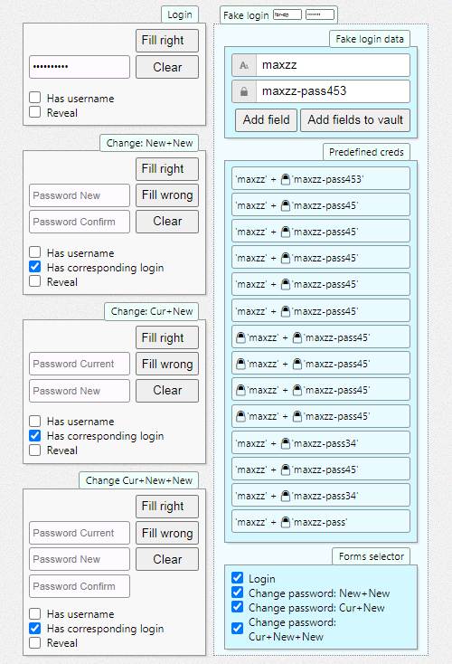

# Overview

This application developed to test the Password Managers ability to handle different login / password change forms.



# Google Design Docs

[Create Amazing Password Forms](https://goo.gl/9p2vKq)

[Autocomplete](https://html.spec.whatwg.org/multipage/form-control-infrastructure.html#autofilling-form-controls%3A-the-autocomplete-attribute) attributes help password managers to infer the purpose of a field in a form, saving them from accidentally saving or autofilling the wrong data. A little annotation can go a long way: some common values for text fields are “username”, “current-password” (login forms and change password forms) and “new-password” (registration and change password forms). See a [detailed write-up](https://www.chromium.org/developers/design-documents/form-styles-that-chromium-understands) with examples.

Fields that are not passwords, but should be obscured, such as credit card numbers, may also have a type="password" attribute, but should contain the relevant autocomplete attribute, such as "cc-number" or "cc-csc".

## Examples: Password Form Styles that Chromium Understands
[Password Form Styles that Chromium Understands](https://www.chromium.org/developers/design-documents/form-styles-that-chromium-understands)

## Autofill Examples

[Help users checkout faster with Autofill](https://developers.google.com/web/updates/2015/06/checkout-faster-with-autofill)

## W3C Autocomplete

[4.10.18.7.1 Autofilling form controls: the autocomplete attribute](https://html.spec.whatwg.org/multipage/form-control-infrastructure.html#autofilling-form-controls%3A-the-autocomplete-attribute)

User agents sometimes have features for helping users fill forms in, for example prefilling the user's address based on earlier user input. The autocomplete content attribute can be used to hint to the user agent how to, or indeed whether to, provide such a feature.

## Account Chooser and Email First

[Email First](https://developers.google.com/identity/toolkit/web/account-chooser#email_first)

## Password Generation

[Password Generation](https://www.chromium.org/developers/design-documents/password-generation)

## OS X Password Manager/Keychain Integration

[OS X Password Manager/Keychain Integration](https://www.chromium.org/developers/design-documents/os-x-password-manager-keychain-integration)

Note: As of version 45, the password manager is no longer integrated with Keychain, since the interoperability goal discussed in the Background section is no longer possible. This document is here for historical purposes only.

[Issue 466638: Remove OS X Keychain integration for saved passwords](https://bugs.chromium.org/p/chromium/issues/detail?id=466638)

Starting in OS X 10.9, Apple introduced the iCloud Keychain. This manifests itself as the “Local Items” keychain in Keychain Access. Items in this keychain are only accessible to applications with the keychain-access-groups entitlement [1][2]. This, like other iCloud entitlements, is “available only to apps submitted to the App Store or to the Mac App Store” [3].

# Misc notes for Vue.js

https://jsfiddle.net/tiagomatosweb/vqtnpyzw/ <- started with
https://www.vuemastery.com/blog/vue-3-start-using-it-today/

TODO: Firefox is grabbing credentials when value is changed (has -> clear)

```js
[...$0.children].map((_) => _.value)

// activated only when somebody asked
    computed: {
        allData: function() {
            let q = this.opt_hasUsername;
            let s = JSON.stringify(this.$data);
            console.log(s + q);
        }
    },

```

## Development

This applications is not using any bundlers (jsut for fun because we can). Just open with `Live Server` on `testcase16-password-change.html` and run `Watch Sass` VSCode extension.

# Done
